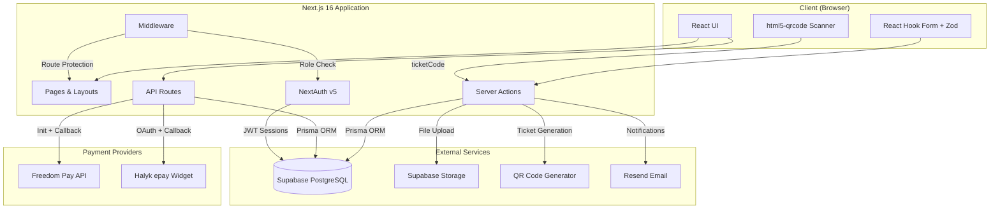
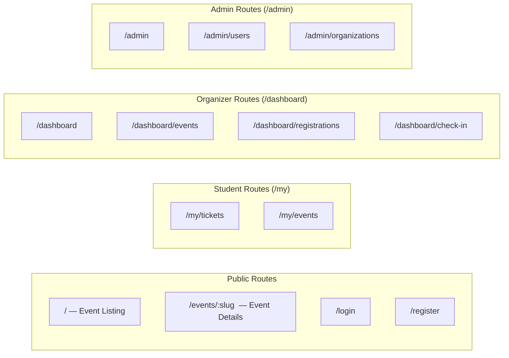
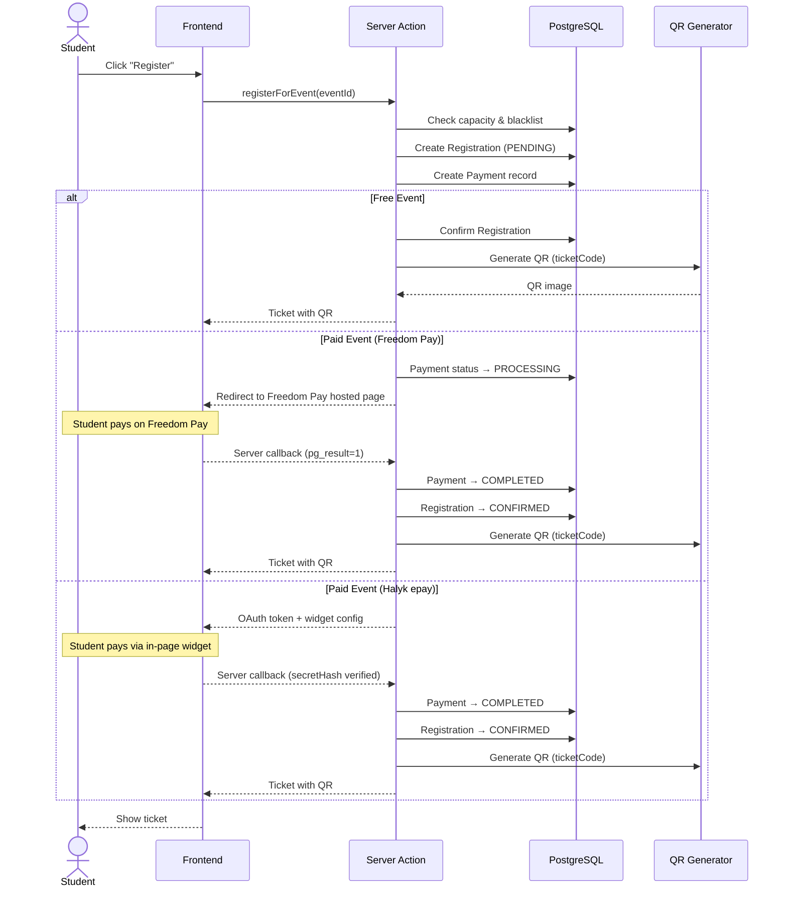
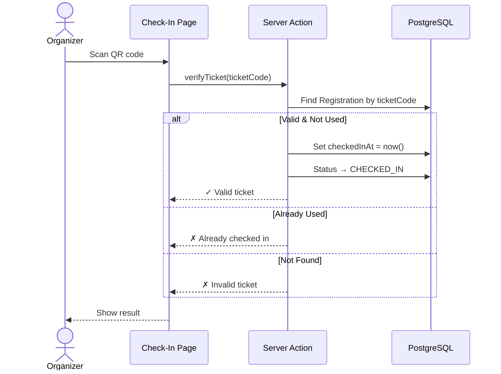
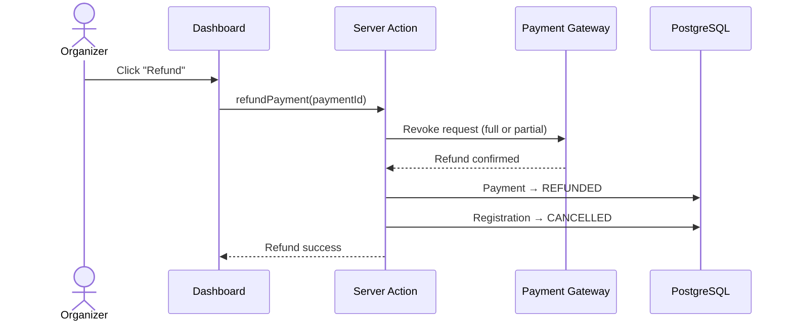
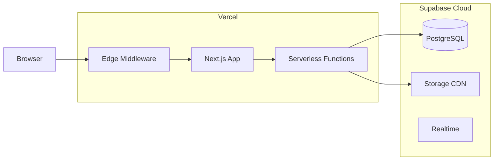

# System Architecture

## Overview

Uvento is a university event management platform built with a modern full-stack architecture. The system enables organizers to create and manage events, while students can browse, register, and receive QR-coded tickets for attendance tracking.

## Tech Stack

| Layer | Technology |
|-------|-----------|
| Frontend | Next.js 16, React 19, Tailwind CSS 4 |
| Backend | Next.js Server Actions, API Routes |
| Database | PostgreSQL (Supabase) |
| ORM | Prisma 6 |
| Authentication | NextAuth v5 (Auth.js) |
| File Storage | Supabase Storage |
| QR Generation | qrcode (npm) |
| QR Scanning | html5-qrcode |
| Payments | Freedom Pay, Halyk epay (phased) |
| Email | Resend |
| Validation | Zod 4 |
| Forms | React Hook Form |
| Deployment | Vercel (planned) |

## Architecture Diagram

## Component Architecture

## Authentication & Authorization

The system uses role-based access control (RBAC) with three roles:

| Role | Access |
|------|--------|
| **STUDENT** | Browse events, register, view own tickets |
| **ORGANIZER** | All student permissions + create/manage events, view registrations, check-in attendees |
| **ADMIN** | Full system access, user management, organization management |

Route protection is handled via Next.js middleware:
- `/admin/*` — ADMIN only
- `/dashboard/*` — ORGANIZER and ADMIN
- `/my/*` — any authenticated user
- Public routes — no auth required

## Data Flow: Event Registration

## Data Flow: Check-In

## Data Flow: Payment Refund

## Deployment Architecture

**Deployment plan:**
- **Frontend + Backend**: Vercel (automatic deploys from `main` branch)
- **Database**: Supabase PostgreSQL (managed, auto-backups)
- **File Storage**: Supabase Storage (event covers, avatars)
- **Domain**: Custom domain via Vercel

## Planned Features (Stakeholder Requirements)

Features mapped to implementation phases:

### Phase 1 — MVP (Current)
| Feature | Status | Description |
|---------|--------|-------------|
| Role-based access (RBAC) | Done | STUDENT, ORGANIZER, ADMIN roles with middleware protection |
| Authentication | Done | Email/password via NextAuth v5 with JWT sessions |
| Event CRUD | In Progress | Create, edit, publish, cancel events |
| Registration & Tickets | In Progress | Register for events, unique QR ticket per registration |
| QR Check-In | Planned | Scan QR at event entrance, one-time use verification |
| Manual payment confirmation | Planned | Organizer confirms payment in dashboard |

### Phase 2 — Launch
| Feature | Description |
|---------|-------------|
| Automated payments | Freedom Pay integration (init → pay → callback → refund) |
| Automatic guest counting | Real-time count of purchased tickets, registered and checked-in guests |
| Total revenue calculation | Auto-calculate ticket revenue, discounts, and final profit per event |
| Email notifications | Registration confirmation, ticket delivery, event reminders via Resend |

### Phase 3 — Growth
| Feature | Description |
|---------|-------------|
| Halyk epay | Second payment option with in-page widget (better UX) |
| Promotions (3+1, 5+1) | Organizers create promotional rules; system auto-applies discounts |
| Blacklists | Organizers manage blacklist per organization; system checks on registration |
| Table assignment & seating | Assign tickets to tables, display seating information for guests |
